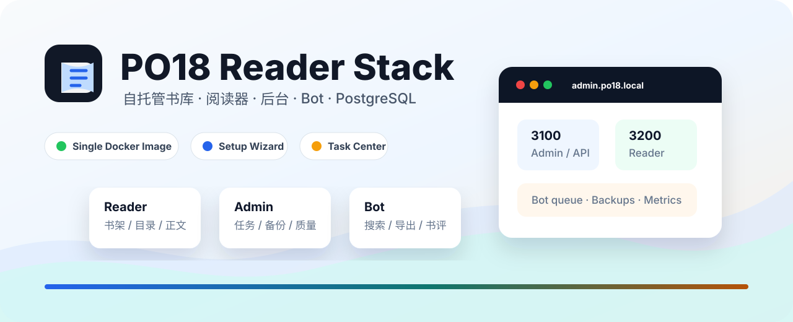

# PO18 Reader Stack



PO18 Reader Stack 是一套面向个人或小团队自托管的小说书库平台，把 PostgreSQL 后端、管理后台、网页阅读器、Telegram Bot、缓存上传、PO18 辅助遍历、任务中心和备份恢复整合在同一个代码库与 Docker 镜像中。

> 本项目不是 PO18 官方服务，也不提供账号、Cookie、数据库内容或书籍正文。请只处理你有权访问的内容，并遵守目标站点规则与当地法律。

## 当前发布

| 项目                   | 当前值                                  |
| ---------------------- | --------------------------------------- |
| Docker 镜像            | `wenmoux/reader:v2.0`                   |
| Node.js                | 20                                      |
| 默认并持续验证的数据库 | PostgreSQL 16                           |
| 最新迁移               | `023_taxonomy_conflict_deduplication`   |
| 后台/API               | `3100`                                  |
| Reader                 | `3200`                                  |
| Bot 健康检查           | `3300`，建议仅容器内部或 localhost 使用 |

推送 `main` 后，GitHub Actions 会执行测试、前端构建、真实 PostgreSQL 验证、Docker 冒烟和 registry digest 冒烟，再更新 Docker Hub 移动标签。本机不需要安装 Docker 来发布镜像。

## 功能总览

### Reader

- 读者注册、CDK 激活、账号登录和 Telegram 登录。
- 书库搜索、书籍详情、书架、阅读历史和继续阅读。
- 长目录虚拟列表、章节进度、主题、简繁转换、正文纠错和多种 TTS。
- PWA 静态壳、按读者账号隔离的离线章节与离线进度补传。
- 书评浏览、投票、举报和申诉入口。

### Admin 与 Setup

- Setup 向导负责数据库测试、初始管理员、安全 Token、Bot 和 WebDAV 配置。
- Admin 覆盖书库、章节、用户、交易、CDK、反馈、纠错、平台映射、榜单和数据质量。
- Admin 采用分组导航与任务优先总览；系统、TG Bot、反馈按工作区分栏，移动端使用抽屉导航，长任务运行时自动刷新。
- 支持 owner/operator/moderator/viewer RBAC、追加式操作审计和内部 API Token 管理。
- 任务中心统一展示备份、恢复、排行榜、Bot 导出、书架同步、Crawler 和维护任务。
- Book Manifest 支持逐章 SHA-256、校验、增量导入以及跨平台同号冲突拒绝。

### Telegram Bot

- 搜书、热门、随机推荐、热搜词云、详情和收藏按钮；平台后缀复用后台实际配置及历史别名，标签搜索覆盖只有元信息的书。
- 签到、账户、流水、排行榜、CDK、红包和众筹。
- TXT/EPUB 导出；EPUB 会先选择样式，再进入持久任务、额度和扣费流程。
- PO18 登录、验证码、已购书架同步和共享上传。
- 书评发布、查看、举报、申诉和任务查询/取消。
- 管理员可在 Bot 或后台发布全员通知，按注册用户分页、限速私聊并在任务中心查看发送统计；不追踪用户是否已读。
- Bot 不直连 PostgreSQL；业务数据通过后端的 Reader/Bot/Upload API 访问。

### 数据、运维与安全

- PostgreSQL 有序迁移、checksum 漂移检查、advisory lock 和显式 rollback。
- 手动/后台创建本地备份、WebDAV/S3 远端上传、可选 AES-256-GCM 加密和对已有最新备份的定期恢复演练。
- `/health/*`、Prometheus `/metrics`、结构化日志、慢查询和来源健康指标。
- Session、CSRF、CORS、SSRF 防护、分路由请求体限制、限流、Scope Token 和凭据加密。

## 架构与运行模式

```text
Browser / Userscript / Telegram
              │
              ▼
┌──────────────────────────────────────────────────────────┐
│ server-pg :3100                                          │
│ Admin · Setup · Reader API · Bot API · Upload API        │
│ OpenAPI · Ranking · Jobs · Backup · Migration            │
└──────────────────────────┬───────────────────────────────┘
                           │
              ┌────────────┴────────────┐
              ▼                         ▼
     Reader server :3200       Telegram Bot :3300
              │                         │
              └────────────┬────────────┘
                           ▼
                     PostgreSQL 16
```

支持两种形态：

- **单容器**：镜像默认运行 `docker/run-all.js`，分别监管 server、Reader 和 Bot；适合最简单部署。
- **Compose**：PostgreSQL、server、Reader、Bot 为四个容器，三个应用容器复用同一镜像；适合独立健康检查和进程隔离。

详细边界见 [架构说明](docs/ARCHITECTURE.md)。

## 快速部署

### 单容器与 Setup 向导

适合已有外部 PostgreSQL，或希望先通过网页填写配置的场景：

```bash
docker pull wenmoux/reader:v2.0
docker run -d --name po18-app --restart unless-stopped \
  -p 3100:3100 -p 3200:3200 \
  -v /opt/po18/config:/config \
  wenmoux/reader:v2.0
```

首次无配置启动时，日志会显示 Setup Token：

```bash
docker logs po18-app
```

打开：

```text
http://服务器IP:3100/setup?token=日志中的TOKEN
```

向导会自动生成 Session、上传 API、Bot API 和 Metrics Token。保存后容器退出，并由 `--restart unless-stopped` 自动拉起。默认安全导出为剔除密码、Token、Cookie、数据库 URL 和加密密钥的 `app.safe.env`；完整秘密导出必须额外确认。

运行地址：

- Admin/API：`http://服务器IP:3100`
- Reader：`http://服务器IP:3200`
- Setup 状态：`http://服务器IP:3100/setup/status`
- 运行日志：`http://服务器IP:3100/setup/logs`

### Docker Compose

适合把 PostgreSQL 一起部署：

```bash
cp .env.docker.example .env
```

至少替换所有 `change-this` / `replace-with` 值，尤其是：

- `POSTGRES_PASSWORD` 与 `PO18_PG_URL` 中的密码必须一致。
- `PO18_UPLOAD_ADMIN_PASSWORD`
- `PO18_UPLOAD_SESSION_SECRET`
- `PO18_UPLOAD_API_TOKEN`
- `PO18_BOT_API_TOKEN`
- `PO18_METRICS_TOKEN`
- `TELEGRAM_BOT_TOKEN`；完整 Compose 会启动 Bot，因此必须替换。若不用 Bot，按下方无 Bot 命令只启动前三个服务。

启动 Docker Hub 镜像：

```bash
docker compose -f docker-compose.hub.yml up -d
docker compose -f docker-compose.hub.yml ps
```

不使用 Telegram Bot：

```bash
docker compose -f docker-compose.hub.yml up -d postgres server-pg reader
```

不要在仍启动 `bot` 服务时把 Token 留空；Bot 会明确失败退出并被 restart policy 重启。

`PO18_METRICS_TOKEN` 在生产环境绑定 `0.0.0.0` 时是必填项，不是可选项。完整部署、反向代理、只读容器和备份说明见 [DOCKER.md](DOCKER.md)。

## 更新镜像与数据库迁移

Compose：

```bash
docker compose -f docker-compose.hub.yml pull
docker compose -f docker-compose.hub.yml up -d
```

单容器：先拉取镜像，再按原端口和 `/config` 挂载重建容器。不要删除 `/config` 或 PostgreSQL 数据卷。

数据库迁移在 server 启动时自动执行：

- 普通查询默认超时 30 秒；迁移默认独立使用 10 分钟。
- advisory lock 保证同一时间只有一个实例改 schema。
- 日志出现 `database migrations are running in another instance` 表示另一个实例持有迁移锁，通常不是故障。
- 大库执行 `020_taxonomy_and_quality_semantics` 可能持续数分钟；应等待 `applied 020...`，不要反复重启。

详见 [数据库迁移手册](db/MIGRATIONS.md) 与 [排障手册](docs/TROUBLESHOOTING.md)。

## EPUB 导出样式

| 样式     | ID       | Bot 可选 | Admin 预览 | 说明                                                       |
| -------- | -------- | -------- | ---------- | ---------------------------------------------------------- |
| 江湖纸卷 | `style1` | 是       | 是         | 纯白阅读底、原版字体、红黑章头、竖排分卷                   |
| 老二次元 | `style2` | 是       | 是         | 插画式页面，可编辑文字、CSS 和图片资源                     |
| 空门夜雨 | `style3` | 是       | 是         | 完整原版字体、轻灰说明框、下划线分卷标题、居中粗宋章题     |
| 丹青云卷 | `style4` | 是       | 是         | 彩墨制作说明/信息/简介、双原字体、竖排分卷、无头图双色章题 |
| 仙鹤章头 | `crane`  | 当前否   | 否         | 旧导出兼容样式，可由已有配置继续使用                       |

分卷页只根据真实非空分卷数据生成，不会自动补“正文”。“空门夜雨”使用纯排版分卷；“丹青云卷”使用彩墨长屏分卷并增加独立书籍信息页，但明确不打包或引用固定正文章头图。可见封面同时生成长屏适配图，原图仍用于书库封面元数据。正文首行与章节标题完全等价时会自动去重。开发说明见 [EPUB 样式文档](bot/epub-styles/README.md)。

## 健康检查与备份

```bash
docker exec po18-app node docker/status-check.js local
docker exec po18-app tail -n 200 /config/runtime.log
```

主要端点：

- `GET /health/live`：进程存活。
- `GET /health/ready`：数据库、schema 与应用启动就绪；迁移提交前返回 `503`，此时业务接口同样拒绝流量。
- `GET /health/version`：镜像、版本、revision 和源码指纹。
- `GET /health/deep`：数据库、磁盘、Reader、Bot 和 Telegram 深度检查。
- `GET /metrics`：需要 `Authorization: Bearer <PO18_METRICS_TOKEN>`。

数据库备份默认保存到 `/config/backups`。后台支持手动创建/上传 dump、恢复前校验、恢复前自动备份以及对已有最新备份执行恢复演练；当前没有自动“创建备份”计划。远端加密备份需要自行取回并解密后再上传恢复。生产操作见 [DOCKER.md](DOCKER.md)。

## 本地开发

安装三组依赖：

```bash
npm ci
npm --prefix admin-ui ci
npm --prefix cirno-src ci
```

常用命令：

```bash
npm start                              # 后端，默认 3100
npm run bot                            # Telegram Bot
npm --prefix admin-ui run dev          # Admin 开发服务器
npm --prefix cirno-src run dev         # Reader 开发服务器
npm run admin:build                    # 构建并发布 Admin 静态文件
npm --prefix cirno-src run build:standalone
npm test
npm run check:docs
npm run check:utf8
npm run check:schema
npm run lint
```

发布默认流程是命令行提交并推送 `main`，由 GitHub Actions 更新 Docker Hub；不要把 Docker Hub Token 或 GitHub Token 写入仓库、远端 URL 或命令历史。

## 目录结构

```text
.
├─ .github/        CI、Docker 发布和 Dependabot
├─ admin-ui/       Vue 3 Admin
├─ bot/            Telegram Bot 与 EPUB 构建器
├─ cirno-src/      Vue 3 Reader 与 Reader server
├─ db/             migrations、rollbacks、schema snapshot
├─ docker/         入口、Setup、监管、状态和备份工具
├─ docs/           当前架构、配置和排障文档
├─ monitoring/     Prometheus 告警规则
├─ routes/         Express 路由
├─ services/       业务服务
├─ scripts/        构建、验证、维护和发布脚本
├─ tests/          Node 与冒烟测试
├─ ui/             Admin/Setup 共用设计令牌与 EPUB CSS
├─ API.md          人工维护的接口示例和兼容说明
├─ DOCKER.md       部署与运维手册
└─ Dockerfile      多阶段、单镜像构建
```

## 文档

统一入口见 [文档索引](docs/README.md)。常用文档：

- [Docker 部署与运维](DOCKER.md)
- [配置参考](docs/CONFIGURATION.md)
- [排障手册](docs/TROUBLESHOOTING.md)
- [API 文档](API.md) 与运行时 `/openapi.json`
- [数据库迁移](db/MIGRATIONS.md)
- [Bot 命令与运行方式](bot/README.md)
- [阶段更新记录](PROJECT_UPDATE_LOG.md)
- [Agent 协作规则](AGENTS.md) 与 [L1 项目地图](CLAUDE.md)；各核心目录的 `CLAUDE.md` 是对应 L2 模块地图，源码头部是 L3 契约。

## 数据、隐私与免责声明

不要提交或分享以下内容：`.env`、`/config/app.env`、运行日志、数据库 dump、Cookie、账号密码、Telegram Token、加密密钥和私人正文缓存。普通 Setup 配置导出默认已经脱敏，但仍应在分享前人工检查。

本项目适合个人或小规模可信用户自托管。当前数据模型仍保留部分平台无感的 `book_id` 兼容路径；跨平台同号 Manifest 会拒绝导入，但在完成统一 `book_key` 迁移前，不建议把系统直接作为开放注册的公网多租户服务。
